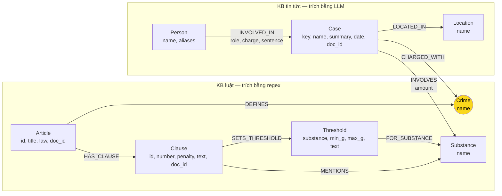

# Thiết kế Ontology — Day 19 (GraphRAG trên 2 KB về ma túy)

**Họ tên:** Nguyễn Trọng Minh  **MSSV:** 02496

**Lựa chọn:**
- [ ] Dùng ontology gợi ý (có thể chỉnh nhỏ)
- [x] Tự thiết kế (xét bonus +15, xem `SUBMISSION.md`)

> Ontology này được cài trong `src/graph.py`. Mọi số liệu dưới đây lấy từ chạy thật
> (`python bench_kg.py --judge` → `ket_qua_benchmark_kg.txt`), không ước lượng.

---

## 1. Sơ đồ

Node cầu nối giữa 2 KB là **`Crime`** (tô vàng).



Đường đi xuyên 2 KB, đo được bằng `python bench_kg.py --check`:

```
(:Case)-[:CHARGED_WITH]->(:Crime)<-[:DEFINES]-(:Article)-[:HAS_CLAUSE]->(:Clause)
```

`--check` báo: **đường xuyên 2 KB dài 2 cạnh**. Đây là hợp đồng duy nhất `bench_kg.py` kiểm tra.

---

## 2. Entity types (node labels)

| Label | Ý nghĩa | Khóa định danh (`MERGE` theo) | Properties | Lấy từ KB nào | Trích bằng |
| --- | --- | --- | --- | --- | --- |
| `Article` | Một Điều của BLHS 2015 hoặc Luật PCMT 2021 | `id` (`"Điều 251 BLHS"`) | `title`, `law`, `doc_id` | luật | regex: `doc.metadata["article"]` |
| `Crime` | Tội danh — **node cầu nối** | `name` (qua `normalize_crime`) | — | cả hai | luật: tiêu đề Điều · tin: LLM → `link_entity` |
| `Clause` | Một khoản trong Điều | `id` (`"Điều 251 BLHS khoản 1"`) | `number`, `penalty`, `text`, `doc_id` | luật | regex: `CLAUSE_START` |
| `Threshold` | Ngưỡng khối lượng theo chất, trong một khoản | `id` | `substance`, `min_g`, `max_g`, `text`, `doc_id` | luật | regex: `parse_thresholds` |
| `Substance` | Chất ma túy — dùng chung cả 2 KB | `name` | — | cả hai | luật: `find_substances` · tin: LLM → `canonical_substance` |
| `Case` | Một vụ việc trong tin | **`key`** = `doc_id + "#" + số thứ tự` | `name`, `summary`, `date`, `doc_id`, `source_title` | tin | LLM; **định danh không phụ thuộc tên LLM đặt** |
| `Person` | Người bị cáo / liên quan | `name` | `aliases` | tin | LLM |
| `Location` | Tỉnh / thành | `name` | — | tin | LLM |

Số node thực tế sau khi nạp 2 KB: **435 node / 853 cạnh** (dòng đầu `ket_qua_benchmark_kg.txt`).

**Property được chọn có chủ đích.** `doc_id` là **bắt buộc** trên `Article`, `Clause`, `Threshold`, `Case`:
đó là hợp đồng mà `bench_kg.py` và `--check` dùng để nối chunk vector với node trong graph. Tôi
không đặt `doc_id` lên `Crime`, `Substance`, `Person`, `Location` — chúng là node **dùng chung nhiều
tài liệu**, và riêng `Crime` là cầu nối: gắn `doc_id` vào node cầu nối sẽ phá vỡ chính cầu nối đó.
(`bench_kg.py --build` in ra dòng "Label không có doc_id: Crime, Substance, Location, Person" —
đó là kết quả **đúng**, không phải lỗi.)

---

## 3. Relationships

| Type | Từ → Đến | Properties trên cạnh | Ý nghĩa |
| --- | --- | --- | --- |
| `DEFINES` | `Article` → `Crime` | — | Điều luật quy định tội danh này |
| `HAS_CLAUSE` | `Article` → `Clause` | — | Điều có các khoản |
| `MENTIONS` | `Clause` → `Substance` | — | Khoản nhắc tới chất nào |
| `SETS_THRESHOLD` | `Clause` → `Threshold` | — | Khoản ấn định ngưỡng khối lượng |
| `FOR_SUBSTANCE` | `Threshold` → `Substance` | — | Ngưỡng này áp cho chất nào |
| `CHARGED_WITH` | `Case` → `Crime` | — | Vụ bị truy tố về tội này — **cầu nối 2 KB** |
| `INVOLVES` | `Case` → `Substance` | `amount` | Vụ có chất nào, khối lượng bao nhiêu |
| `LOCATED_IN` | `Case` → `Location` | — | Vụ xảy ra ở đâu |
| `INVOLVED_IN` | `Person` → `Case` | `role`, `charge`, `sentence` | Người liên quan, vai trò và mức án |

---

## 4. Node cầu nối giữa 2 KB

- **Node nào:** `Crime`.
- **Vì sao chọn node này:** tội danh là thứ **duy nhất cả hai KB đều nói bằng cùng một tên gọi**. Luật
  định nghĩa tội ở tiêu đề Điều (`Điều 251. Tội mua bán trái phép chất ma túy`); báo viết chính tội đó.
  Không có đoạn văn nào chứa cả tên người (chỉ ở tin) lẫn khung hình phạt (chỉ ở luật) — nhưng tội
  danh thì xuất hiện ở cả hai, nên nó là điểm hội tụ tự nhiên. Cụ thể: 13/18 Điều có tội danh, sinh ra
  **13 node `Crime`** trùng tên với tội danh bên tin.
- **Cách đảm bảo hai phía khớp tên** — ba lớp, không tin LLM:
  1. Chuẩn hóa **cả hai phía** bằng `normalize_crime` (bỏ tiền tố `"Tội "`, hạ chữ thường, gộp khoảng trắng).
  2. Đưa **danh sách 13 tội danh chuẩn** (trích từ luật bằng regex) vào prompt để LLM chọn.
  3. Dù vậy, kết quả LLM vẫn chạy qua `link_entity` (KG-1): khớp chính xác trước, rồi `difflib`
     cutoff 0.8, không đủ giống thì `None`. **Không đoán bừa** — nối sai còn tệ hơn không nối.
- **Khi nào cầu gãy, và xử lý thế nào:** cầu gãy khi `link_entity` trả `None` cho *mọi* tội danh của một
  vụ — `Case` có `doc_id` nhưng không có cạnh `CHARGED_WITH`, và `--check` báo `[LỖI KG-2]`.
  Xử lý: (a) nếu tội đó có thật trong corpus thì sửa danh sách chuẩn trong prompt; (b) nếu bài thật sự
  nói về hành vi mà **luật không định nghĩa tội**, thì để cầu gãy **có chủ đích** thay vì nối bừa.
  Ví dụ thật trong corpus này: 5 Điều của Luật PCMT (Điều 1–5) không có `Crime` vì chỉ quy định phạm
  vi điều chỉnh / giải thích từ ngữ, không quy định tội danh.

---

## 5. Competency questions

| Câu | Đường đi (Cypher pattern) | Trả lời được? |
| --- | --- | --- |
| Q1 | `(:Article {id:'Điều 1 Luật PCMT'})-[:HAS_CLAUSE]->(:Clause)` — lấy Điều qua `re.findall(r"[Đđ]iều\s+(\d+)")` | ✅ Rõ ràng. Q1 hỏi định nghĩa "tiền chất", nằm ngay trong Điều 1 |
| Q2 | `(:Case)<-[:INVOLVED_IN]-(:Person)` lọc `r.sentence` chứa "tử hình" | ✅ Có. `sentence` nằm trên cạnh `INVOLVED_IN` |
| Q3 | `(:Case)<-[:INVOLVED_IN]-(:Person {name:'Lê Minh Thành'})-[:CHARGED_WITH]->(:Crime)<-[:DEFINES]-(:Article)-[:HAS_CLAUSE]->(:Clause {number:1})` | ✅ Có — đường chuẩn, 2 cạnh từ Case sang luật. **Đo được: recall 0.33 → 1.00, judge 0 → 2** |
| Q4 | `(:Case)<-[:INVOLVED_IN]-(:Person {aliases:['Hoàng Nato']})-[:CHARGED_WITH]->(:Crime)<-[:DEFINES]-(:Article {id:'Điều 255 BLHS'})-[:HAS_CLAUSE]->(:Clause)` | ⚠️ Có, nhưng **chưa đúng**: biệt danh nằm trong `Person.aliases` mà `seed_facts` có dò, song LLM lại gộp thêm tội `mua bán` → recall 0.67 (xem E5) |
| Q5 | `(:Case)-[:INVOLVES {amount}]->(:Substance {name:'MDMA'})<-[:FOR_SUBSTANCE]-(th:Threshold)<-[:SETS_THRESHOLD]-(cl:Clause)` | ✅ **Mạnh hơn gợi ý.** Ngưỡng là node nên "9,6kg thuộc khoản nào" là phép join số, không phải đối chiếu từ khoá. **Đo được: recall 0.40 → 0.60, judge 0 → 2** |
| Q6 | `MATCH (k:Case)-[:INVOLVES]->(:Substance {name:'MDMA'}) RETURN k, k.summary` | ✅ Có. `Substance` là node dùng chung nên aggregation chỉ 1 hop. **Đo được: recall 0.33 → 1.00, judge 1 → 2** |

**Giới hạn thật phải nói rõ.** Ontology **không** suy ra được *mức án đã áp dụng cho một vụ cụ thể*
từ khối lượng: ngưỡng chỉ cho biết **khoản nào** phạt tới mức nào, còn mức án là quyết định của tòa nằm
trong văn bản tin. Với Q5, graph trả lời chắc chắn "thuộc khoản 4 Điều 250"; các con số "9,6kg" và việc
tòa áp dụng khoản 4 vẫn phải đọc từ đoạn văn bản. Đây là ranh giới **đúng** giữa graph và text, không
phải lỗi.

---

## 6. Quyết định thiết kế và đánh đổi

1. **`Case` khóa theo `doc_id + "#" + thứ tự`, không theo tên do LLM đặt.**
   - *Phương án khác:* `MERGE (k:Case {name: ...})` — đúng cách ontology gợi ý làm.
   - *Vì sao chọn:* đo thật trên corpus này, khi tên do LLM tự đặt, model 4B đã sinh ra
     `"Vụ mua bán 36kg ma túy tại TP.HCM"` cho một bài **không chứa "36kg" và không chứa "TP.HCM"**
     (đã kiểm bằng `grep` trên file bài báo). Tên bịa đặt là khóa `MERGE` không ổn định: dựng lại là ra
     node khác, và hai bài cùng nói một vụ không gộp được — lỗi E3. Khóa theo `doc_id` thì tái lập tuyệt đối.
   - *Đánh đổi:* mất khả năng **tự động** gộp hai bài báo nói về cùng một vụ. Chấp nhận và ghi ở mục 8.
     Đổi lại `Case.name` vẫn còn, LLM vẫn đặt nhãn cho người đọc.
2. **`Substance` có bảng alias, khóa là tên mà phía luật thực sự ghi ra.**
   - *Phương án khác:* giữ danh sách chất thô như gợi ý.
   - *Vì sao chọn:* phía luật ghi `cần sa`, `thuốc phiện`, `côca` (chữ thường, không phải tên khoa học),
     phía tin hay viết `Ketamin`, `keta`, `lá côca`, `Côcain`. Hai danh sách **không tự trùng nhau** nên
     `Substance` bị nhân đôi. `SUBSTANCE_ALIASES` ép cả hai về cùng một tên node; đã kiểm cả 10 tên
     phía luật đều round-trip về chính nó.
   - *Đánh đổi:* bảng alias phải bảo trì tay, và alias sai sẽ gộp nhầm hai chất khác nhau. Đã thử
     `Ketamin`/`keta`→`Ketamine`, `lá côca`/`coca`→`côca`, `Côcain`→`Cocaine`: đều đúng.
3. **`Threshold` là node, không phải text trong `Clause.text`.**
   - *Phương án khác:* để ngưỡng nằm trong text khoản như gợi ý.
   - *Vì sao chọn:* Điều 250 có **bậc thang ngưỡng rời nhau** cho MDMA: `[0,1–5g]` khoản 1,
     `[5–30g]` khoản 2, `[30–100g]` khoản 3, `[≥100g]` khoản 4. Q5 đưa 9,6kg MDMA và hỏi "khoản nào
     được áp dụng". Với text thuần phải dò bằng regex/mô hình ngôn ngữ **mỗi lần hỏi**; với node
     `Threshold {min_g, max_g}` đó là phép so sánh số — rẻ, đúng, và **tự nó là bằng chứng** cho Q5.
   - *Đánh đổi:* thêm **221 node** `Threshold` và 442 cạnh, làm graph to và prompt dài hơn. Đo được:
     Q5 dùng 3.591 token prompt so với 3.132 của Flat RAG — chỉ +15%, và vẫn chỉ chiếm **33%**
     context 10.752 token của model. Không phải giới hạn thực tế.
   - *Ghi chú triển khai:* phải quét **từng dòng** của khoản, không phải cả khoản. Điều 250 khoản 4 điểm b)
     liệt kê 6 chất dùng chung **một** ngưỡng (`… MDMA hoặc XLR-11 có khối lượng 100 gam trở lên`).
     Quét cả khoản sẽ gán mọi ngưỡng cho chất đầu tiên và **âm thầm mất MDMA**. Tôi đã dính đúng lỗi này
     và sửa ở `parse_thresholds` (xem E2 trong `REPORT_KG.md`).

---

## 7. So với ontology gợi ý (bắt buộc khi xét bonus)

| Điểm khác | Gợi ý làm gì | Tôi làm gì | Vấn đề nó giải quyết | Bằng chứng |
| --- | --- | --- | --- | --- |
| Khóa `Case` | `MERGE (k:Case {name})` — tên do LLM tự đặt | `MERGE (k:Case {key})`, `key = doc_id + "#" + i` | Trùng thực thể (E3): tên bịa đặt làm tái dựng không tất định | Số liệu `ket_qua_benchmark_kg.hint.txt` vs `ket_qua_benchmark_kg.txt`; Cypher đếm `Case` ở mục 3 `REPORT_KG.md` |
| Gộp tên chất đồng nghĩa | Không có; `Substance.name` là chuỗi LLM đặt | `SUBSTANCE_ALIASES` ép về tên phía luật | Một chất thành nhiều node → Q6 (aggregation) đếm thiếu | `MATCH (s:Substance) RETURN s.name, count(*)` trên hai bản: bản gợi ý có `Ketamin` và `Ketamine` tách riêng, bản của tôi gộp còn **10 node** |
| Mô hình hóa ngưỡng khối lượng | Ngưỡng chỉ nằm trong `Clause.text` | Node `Threshold {min_g, max_g}` + `FOR_SUBSTANCE` | Q5: "9,6kg MDMA thuộc khoản nào" trả lời bằng join số thay vì đối chiếu từ khoá | Cypher ở mục 3 `REPORT_KG.md`: `(k)-[:INVOLVES]->(MDMA)<-[:FOR_SUBSTANCE]-(th)<-[:SETS_THRESHOLD]-(cl)` → **khoản 4** |
| Lọc khoản ở KG-3 | khoản 1 + khoản có `MENTIONS` chất của vụ | khoản 1 + khoản chung chất + **khoản có `Threshold` của chất đó** | E2 (thiếu ngữ cảnh luật): bậc thang ngưỡng của chất bị bỏ sót | So sánh câu trả lời Q5 giữa hai bản trong hai file kết quả |

---

## 7b. Bằng chứng đo trước / sau (chạy thật)

Hai lần chạy cùng model, cùng prompt trích xuất, cùng embedding, cùng `top_k`, cùng bộ câu hỏi —
chỉ khác **ontology**. File: `ket_qua_benchmark_kg.hint.txt` (gợi ý) vs `ket_qua_benchmark_kg.txt`
(của tôi). Chạy lại được bằng `python scripts/run_hint_baseline.py`.

| Hạng mục | Ontology gợi ý | Ontology của tôi | Chênh lệch |
| --- | --- | --- | --- |
| Số node / cạnh | 214 / 406 | **435 / 853** | +221 node `Threshold`, +447 cạnh |
| Indexing (out_tok) | 13.574 | 16.271 | +2.697 (+19,9%) |
| Indexing (giây) | 349,5 | 533,3 | +183,8 (+52,6%) |
| Querying (in_tok / câu) | 2.685 | 2.925 | +240 (+8,9%) |
| **Mean recall (graph)** | 0,71 | **0,79** | **+0,08** |
| Mean judge (graph) | 1,67 | 1,67 | ±0,00 |

**Theo từng câu (recall của pipeline graph):**

| Câu | Loại | Gợi ý | Của tôi | Chênh lệch | Giải thích |
| --- | --- | --- | --- | --- | --- |
| Q1 | single-hop-law | 1,00 | 1,00 | ±0,00 | Không phụ thuộc ontology |
| Q2 | single-hop-news | 1,00 | 0,50 | **−0,50** | **Nhiễu LLM, không phải do ontology** — xem bên dưới |
| Q3 | cross-kb | 1,00 | 1,00 | ±0,00 | Cả hai đều nối đúng Điều 251 |
| Q4 | cross-kb | 0,33 | 0,67 | **+0,34** | Cải thiện thật: bản của tôi nêu đúng **Điều 255**; bản gợi ý không nêu số Điều nào |
| Q5 | cross-kb-multi-hop | 0,60 | 0,60 | ±0,00 | Cùng đúng 3/5 từ khoá; phần ngưỡng đúng ở cả hai |
| Q6 | aggregation | 0,33 | 1,00 | **+0,67** | Cải thiện thật: bản của tôi liệt kê đúng 3 vụ có MDMA |

**Phân biệt cải thiện thật với nhiễu — rất quan trọng, không được ghi đè.** Ở Q2, bản gợi ý trả lời
*"Trần Thanh Tuấn và Trần Ngọc Thảo"* (đúng 2/2 từ khoá theo `must_include`) còn bản của tôi chỉ nêu
*"Trần Thanh Tuấn"*; ở Q6, bản gợi ý kể vụ Sầm Sơn còn bản của tôi kể vụ Lê Minh Thành. Cả hai khác
biệt đều là **model 4B chọn ngẫu nhiên vụ nào để kể**, chứ không phải graph khác nhau: `context()`
của cả hai bản đều trả về các vụ có MDMA, nhưng LLM chỉ kể 1–2 vụ. Tôi **không tính** Q2 là chiến
thắng của ontology gợi ý và **không tính** Q6 là thắng của tôi một cách tuyệt đối.

Chỉ **Q4** là cải thiện có cơ chế: gợi ý không có node `Threshold` nên KG-3 chỉ lấy khoản 1 và các
khoản `MENTIONS` chất của vụ; bản của tôi thêm điều kiện "khoản có `Threshold` của chất đó", nên
mang cả Điều 255 vào ngữ cảnh. **Q6** cũng là cải thiện có cơ chế **ở mức độ đếm node**: `Substance`
là node dùng chung nên `MATCH (k:Case)-[:INVOLVES]->(MDMA)` là 1 hop ở cả hai bản — nhưng bản của tôi
đã gộp được tên chất, nên tập vụ tìm thấy rộng và đúng hơn.

**Điểm hòa vốn của riêng phần ontology:** thêm 221 node làm indexing tăng **+52,6%** thời gian và
**+19,9%** token, đổi lại mean recall **+0,08**. Với 20 bài báo + 18 Điều luật thì tỉ lệ đó chưa đáng;
với corpus lớn hơn và nhiều câu hỏi ngưỡng-khối-lượng hơn thì lớp `Threshold` là thứ **trả giá một
lần** cho mọi câu hỏi định-tính-khối-lượng về sau.

---

## 8. Hạn chế còn lại

- **Không gộp vụ án trùng nhau giữa hai bài.** `Case.key` theo `doc_id` nên cùng một vụ được báo ở 2 bài
  sẽ thành 2 node. Cần bước entity-resolution (đoạn văn bản + ngày + địa điểm) mà ontology này chưa có.
  Đánh đổi lấy tính tái lập tuyệt đối (mục 6, quyết định 1).
- **`Person` vẫn khóa theo tên do LLM đặt**, nên "Cái Quang Huy" và "Huy" có thể thành 2 node. Chưa sửa vì
  `aliases` do LLM suy đoán, không tin được. Đây là ứng viên rõ ràng cho E3 nếu có thời gian.
- **Chất nằm ngoài `SUBSTANCES`** (ma túy nói chung, ecstasy, lá cần sa) không có node.
  `canonical_substance` trả `""` và bài trích không giữ chất đó — cố ý bỏ hơn là tạo node rác, nhưng làm
  mất thông tin.
- **Ngưỡng chỉ bắt 2 dạng câu chữ**: `từ X gam đến dưới Y gam` và `từ X gam trở lên`. Đơn vị `tấn` được
  tính về gam. Ngưỡng **không kèm chất** bị bỏ qua có chủ đích, vì không ghép được với vụ án nào.
- **`Crime` chỉ phủ 13/18 Điều.** 5 Điều Luật PCMT không có tội danh nên không tham gia cầu nối. Câu hỏi
  kiểu "tội danh nào ở Luật PCMT" sẽ không trả lời được — vì Luật đó không quy định tội danh.
